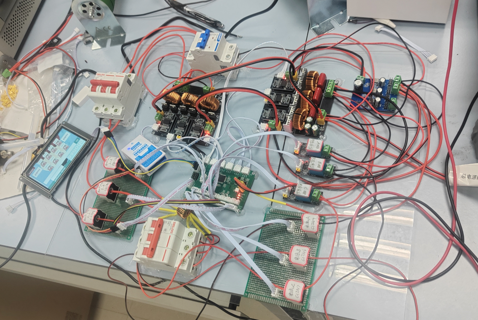

<div align="center">

# 🏆 2025电赛：2025年全国大学生设计大赛：能量回馈的变流器负载实验装置（A题）硬件部分

**基于 STM32G474RBT6 的三相逆变-整流-回馈系统**

[]()
[]()
[](https://creativecommons.org/licenses/by-nc-sa/4.0/)
[](https://github.com/你的用户名/仓库名)

[项目主页](你的链接) · [设计报告](./Documents/report.pdf) · [演示视频](你的B站链接)

</div>

---

## 📖 项目简介
本项目为 **2025年全国大学生电子设计竞赛** 的 [A题：能量回馈的变流器负载实验装置] 作品。


### ✨ 核心特性
* 🎨 **交互友好**：配备串口屏，实现功能切换和调频
* 🛠️ **模块化**：硬件电路采用模块化设计，方便二次开发与维护。

---

## 🛠️ 硬件设计说明

### ⚡ 系统框图
> (基础部分系统框图)

> (发挥部分系统框图)

> (最终作品图)


### 📐 PCB 预览
| Top View (3D) | Bottom View (3D) |
| :---: | :---: |
|  |  |

### 🔍 关键模块参数
* **电源层**：四层板设计，内层完整铺地，保证数字信号与模拟信号的隔离。
* **模拟前端**：基于 [OPAxxx] 的低噪声放大电路，输入阻抗达 [X] MΩ。
* **散热设计**：背部露铜加锡，配合主动散热风扇。

---

## 📂 资源清单
| 文件夹 | 说明 | 格式 |
| :--- | :--- | :--- |
| 📁 `Hardware/` | 原理图、PCB、BOM清单、库文件 | `.SchDoc`, `.PcbDoc`, `.PDF` |
| 📁 `Firmware/` | 基于 [STM32CubeIDE/Keil] 开发的嵌入式代码 | `.c`, `.h` |
| 📁 `Docs/` | 设计报告、计算说明书、测试数据 | `.pdf`, `.xlsx` |
| 📁 `Tools/` | 辅助调试工具、上位机源码 | `.py`, `.exe` |

---

## 🚀 快速上手

### 1. 硬件准备
* 使用 **Altium Designer 24** 或更高版本打开 `Hardware/` 目录下的工程。
* 根据 `BOM.xlsx` 采购元器件（建议选择高精密低温漂电阻）。

### 2. 软件烧录
```bash
# 如果有命令行烧录方式可写在此处，否则写操作步骤
1. 打开 Firmware/Project.uvprojx
2. 编译并烧录至目标板