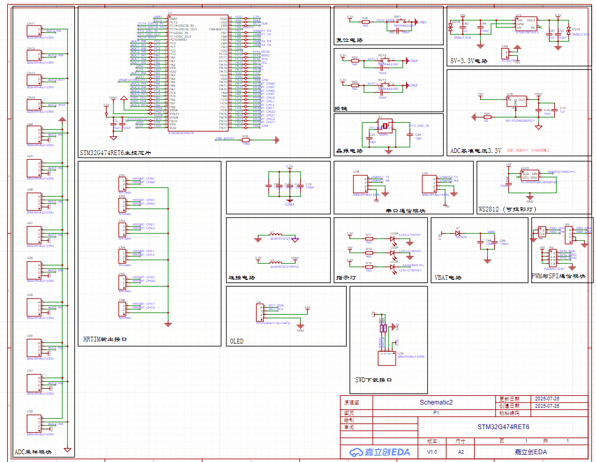
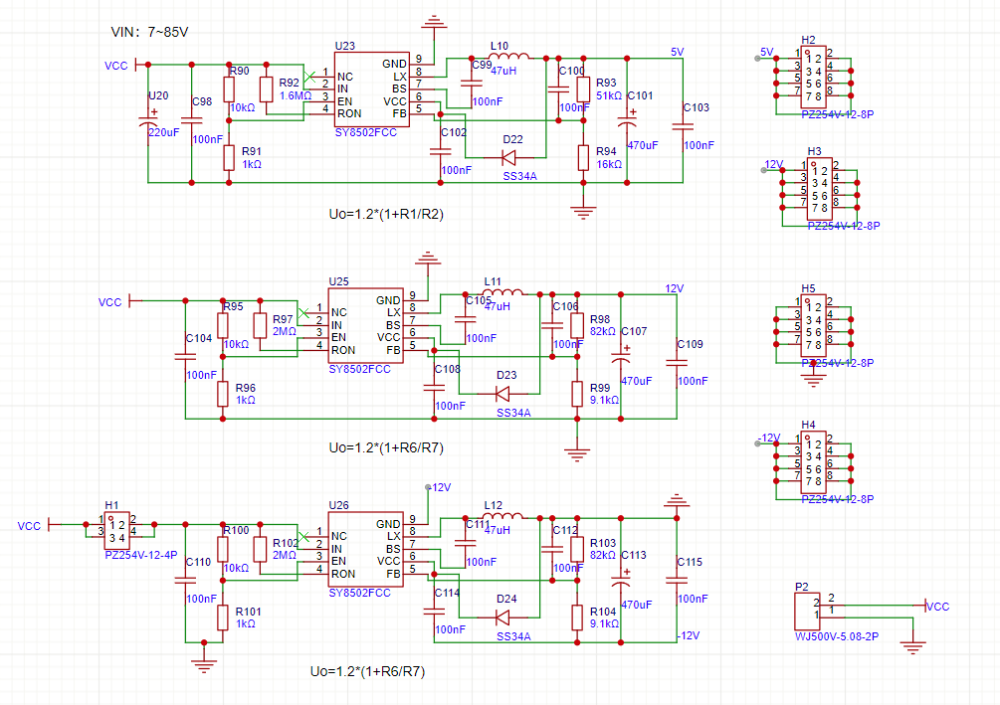
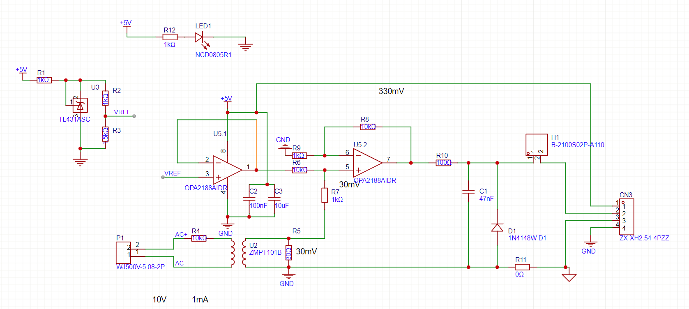
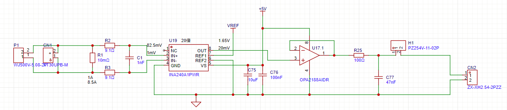
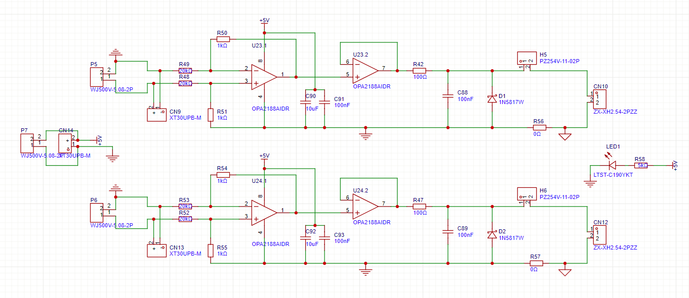
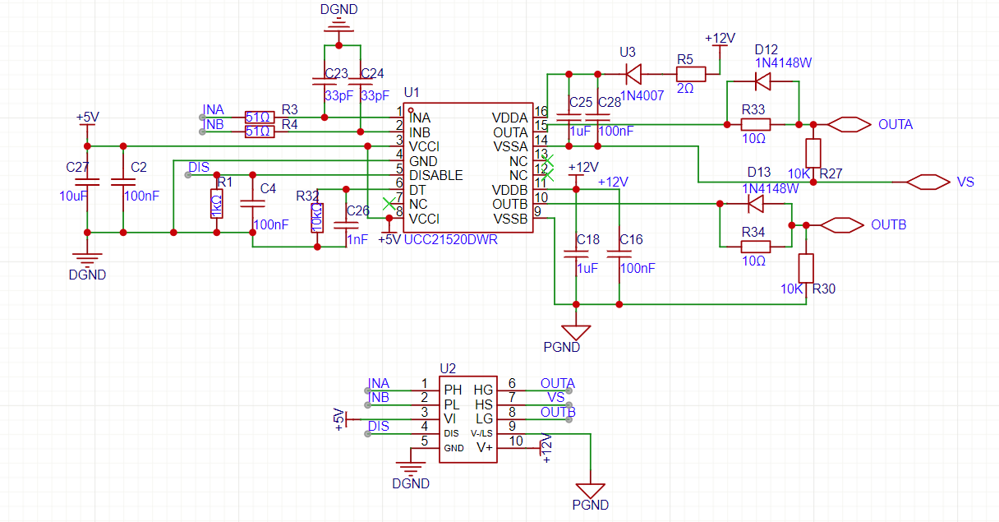
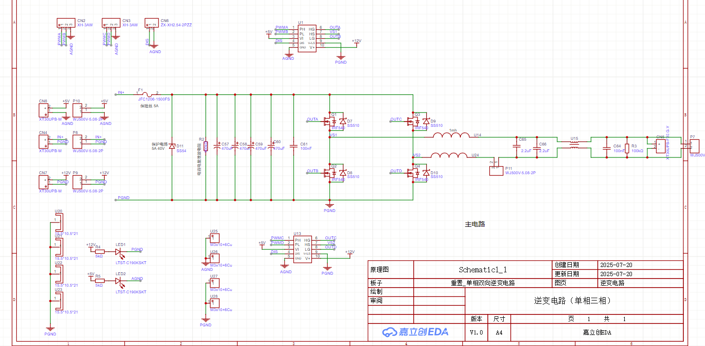
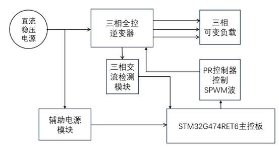
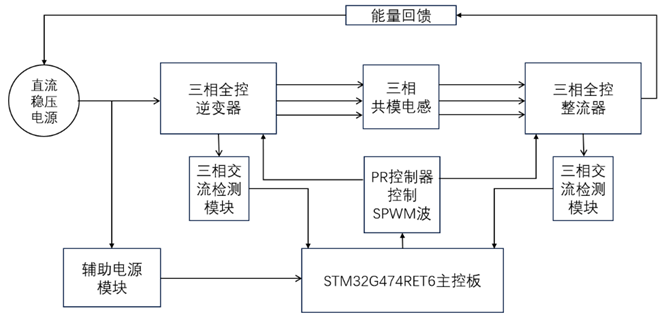

# 🏆 2025年全国大学生设计大赛：能量回馈的变流器负载实验装置（A题）

  <h3>
    <a href="#software">💻 软件篇</a> &nbsp; | &nbsp; 
    <a href="#hardware">🔍 硬件篇</a>
  </h3>

## 💻 软件篇 (Software)

# 软件部分

---

## 📝 写在前面

笔者并未系统学习过开关电源的控制原理，仅依靠先前对机器人电控工作的经验进行本次项目的软件开发。

好在赛前与团队成员形成良好的分工合作，并利用 Bilibili、知乎、CSDN 等网站补齐了一些环路控制原理与 **QPR 控制器**的知识，最后成功完成赛题所有指标。

虽然在综测环节因一些问题执戟沉沙仅获得**省一**，但对于笔者仍然是一次宝贵的竞赛体验。同时也让我建立起了对硬件开发与电源技术的兴趣，这是过往 RoboMaster 电控经历不曾带给我的。

---

## 📂 文件目录结构

* `..\code`
    * **项目作品完整代码**：包含完整的工程文件及源代码。
* `..\simulink`
    * **仿真模型**：备赛期间参考 B 站 UP 主“西瓜粥”搭建的仿真模型。
    * **包含**：单相逆变、离网三相逆变、并网三相逆变。
    * 
* `..\A题_能量回馈的变流器负载试验装置`
    * 
* `..\作品海报`
    * 
* `..\picture`
    * **图片**
---

## 🛠️ 开发平台

### 💻 软件环境
1.  **MCU 开发/调试平台**：
    * `CLion` + `STM32CubeMX` + `Ozone 3.24` + `DAPLink`
2.  **仿真搭建平台**：
    * `MATLAB R2023a`

### ⚙️ 硬件环境
1.  **主控芯片**：`STM32G474RET6`
2.  **电路选型**：(具体电路原件选型略)

---

## 🧠 软件实现思路

### 1. 代码架构
代码框架沿用了我之前搭建的 RoboMaster 电控框架，采用分层设计模式：

* **Application Layer (APL)**：应用层，负责顶层逻辑与任务调度。
* **Middleware Layer (MWL)**：中间件层，处理算法与通用逻辑。
* **Hardware Driver Layer (HDL)**：硬件驱动层（如 `HDL_AC_Measure.cpp`），负责传感器数据读取与底层驱动。
* **Hardware Abstract Layer (HAL)**：硬件抽象层，封装芯片外设接口。

> **核心控制环路位置**：
> `code/Users/0-APL/APL_CallBack/CallBack_ADC/CallBack_HRTIM.cpp`

### 2. 闭环控制整体思路

* 逆变控制思路：
`ADC 采样` $\rightarrow$ `QPR 控制器计算电压环输出` $\rightarrow$ `P 控制器计算电流环输出` $\rightarrow$ `中心对齐 SPWM 调制`  $\rightarrow$ `HRTIM 调整占空比`
* 整流控制思路：
`逆变 SPWM 调制缩放*0.904（测量值）`  $\rightarrow$ `HRTIM 调整占空比` 
<u>之所以采取这种控制方式单纯是因为整流的PR调不出来了，这种方法可以极快速地实现能量的正向流动。</u>

**广西大学** 
**卢俊烨** 
**2025.12.05** 

---

## 🔍 硬件篇 (Hardware)

# 硬件部分

**基于 STM32G474RBT6 的三相逆变-整流-回馈系统**

---
## 📖 前言
本人硬件水平并不算高，仅能保证赛场上基本的电路功能正常实现，但在此基础上的优化设计能力不足，这也一定程度上导致了我们实现所有功能后因性能不足而止步于省一，故而十分惭愧。
在此对自己赛前赛时所绘制的所有板子所得经验教训做一个总结，希望激励自己继续进步。

### ✨ 核心特性
* 🎨 **交互友好**：配备串口屏，实现功能切换和调频
* 🛠️ **模块化**：硬件电路采用模块化设计，方便二次开发与维护。

---

## 🚀 赛前准备
因为电赛涉及DC-DC、DC-AC（单相/三相）、AC-DC（单相/三相）、AC-AC，所以在元件清单出来之前必须准备好这些基本的电路拓扑，为软件调试作准备。
毕竟软件的同学此前并没有接触过电源类的软件操作，如果没有赛前实现基本功能（开环逆变/整流，或是电压闭环控制）的话，赛时根本无法临时写出来。我们大概是在开赛前17天开始进行准备，时间比较极限。
一直到元件清单出来之前，基本上完成了主控板、辅助电源模块、交流电压电流采样模块、直流电压电源采样模块、单相逆变电路、三相逆变电路、buck-boost电路板子的绘制和打样以及焊接（焊接的同学很强，基本上板子一到马上就能焊完了）。
非常幸运，基本上所准备的东西和从元件清单里面猜出的赛题内容大差不差，所以从那时就开始可以进行调试了。

## 🛠️ 硬件设计说明
我们所准备的硬件电路包括以下几个模块
* **主控电路**：G474RBT6主控板。选它也是因为作为数控电源专用芯片，所集成的高分辨率定时器可以直接生成互补pwm波，集成了多个ADC采样端口等等，十分方便。
**具体设计说明**：
1.5V供电，经ldo降压到3.3V再给输入到芯片引脚，因为涉及到ADC采样，所以使用REF3033生成一个标准的3.3V作为芯片的参考电压，分离开数字地和模拟地，因为涉及到多路的PWM波输出，分离的GND可以防止数字信号干扰到模拟信号影响ADC采样结果。
关于ADC采样部分，均使用单端采样（这里格局小了，应该多引出一些差分采样的口，主要是当时担心ADC口不够用，但还好也没造成太大影响），ADC的5V供电直接从主控板提供，这样接线方便一些。
**端口选择技巧**：一般可以从数据手册得知哪一个引脚是有什么功能，但是这样容易出错且不直观，我是直接在cubemx直接开启对应外设，这样可以直接看到哪个引脚对应哪个外设，非常直观，而且不会产生引脚冲突的问题，最后在布线时发现线路不好走，可以直接调整将所需的外设调整到好布线的引脚，可以节省很多时间。

图 1：主控电路原理图

* **辅助电源模块**：sy8502芯片（这部分也是参考了一个立创开源广场的开源，只是他用的好像是sy8205）：sy8502的7-85V的输入电压，1.2A持续电流、1.8A峰值电流，完全适配电赛使用场景，绘制了三部分输出：5V（给主控芯片）（采样芯片）、12V（给栅极驱动芯片）、-12V（备用）

图 2：辅助电源模块电路原理图

* **交流电压电流采样模块**：此部分参考B站upEADdong的教程，最终电流采样模块使用效果不佳，软件的同学建议采用群友的一个方案（贵，但效果十分不错）
里面涉及到采样的电阻全都是精密电阻，提高采样精度，也准备了很多不同阻值的电阻，方便随时根据赛题要求调节放大倍数。

图 3：交流电压采样原理图

* **直流电压电流采样模块**：电压采样部分参考B站upEADdong的教程（基于opa2188运放芯片的电压采样模块），电流部分使用INA240a芯片采样很精准，干扰也很小。
和交流采样一样，使用精密电阻，以及准备随时根据赛题要求更换电阻以调节放大倍数。

图 4：直流电流采样模块原理图

图 5：直流电压采样模块原理图

* **UCC21520栅极驱动模块**：一个隔离式的栅极驱动，信号部分和驱动部分的电路是隔离开的，能一定程度上降低输出电压对输入PWm信号的干扰，但实际上赛场时这部分的供电电路都来源于同一块辅助电源模块，所以最终并没能实现完美的隔离。
这部分不直接画在对应的电路拓扑板子上是为了防止驱动芯片烧坏时无法及时更换，这种方式就赛时使用而言，并没有发现不稳定的情况。赛前焊接了很多块驱动板子，一出问题直接进行更换，以免排查起来浪费时间。

图 6：栅极驱动模块原理图

* **单相逆变电路模块**：按电路拓扑逆过来就是单相整流，三相同理，电感和电容等等不合适都可根据赛题随时更换。

图 7：单相逆变电路模块原理图

* **其他电路拓扑模块**：与单相逆变相同，均做成了可逆的电路，三相逆变与三相整流可逆，buck与boost可逆，ac-ac的部分没有准备，因为很少出现，即使出现了，我们的方案也只是采用先进行整流，再进行逆变的方式实现，虽然效率会较低，但总之先保完成。
这种保完成的想法也导致了我们完成了所有赛题后难以进一步优化，本次赛题的发挥部分要求功率损耗尽可能低，而我们所使用的IRF540mos管型号较老，功率损耗较大，即使发挥部分采用了全控整流的方式，仍然效率不高，这是我们作品一个很大的劣势（如果可以穿越回去，我一定不用这种立起来的老型号mos（\\>^</））。

### ⚡ 赛题作品系统框图

图 8：基础部分系统框图

图 9：发挥部分系统框图

---

## 📂 资源清单
| 文件夹 | 说明 | 格式 |
| :--- | :--- | :--- |
| 📁 `Hardware/` | 原理图、PCB工程文件 | `.epro` |

**广西大学** 
**冯滢妮** 
**2026.1.25** 

