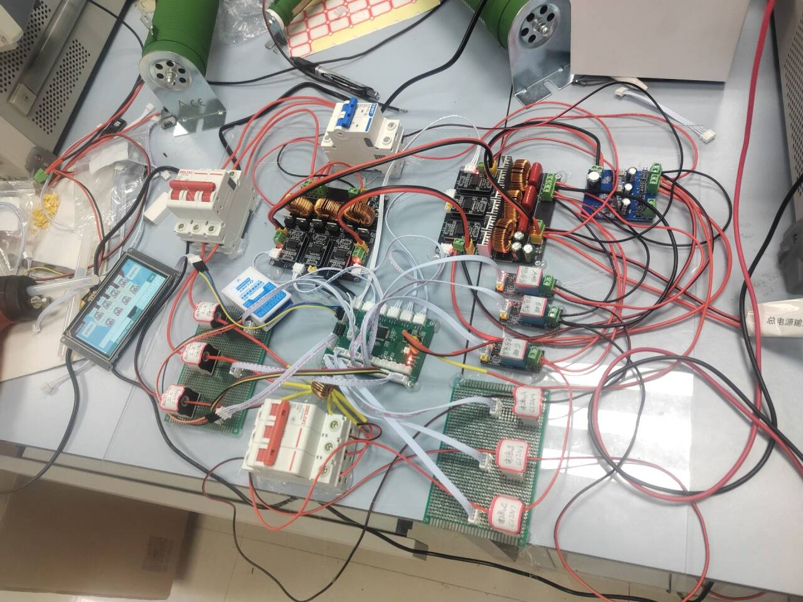
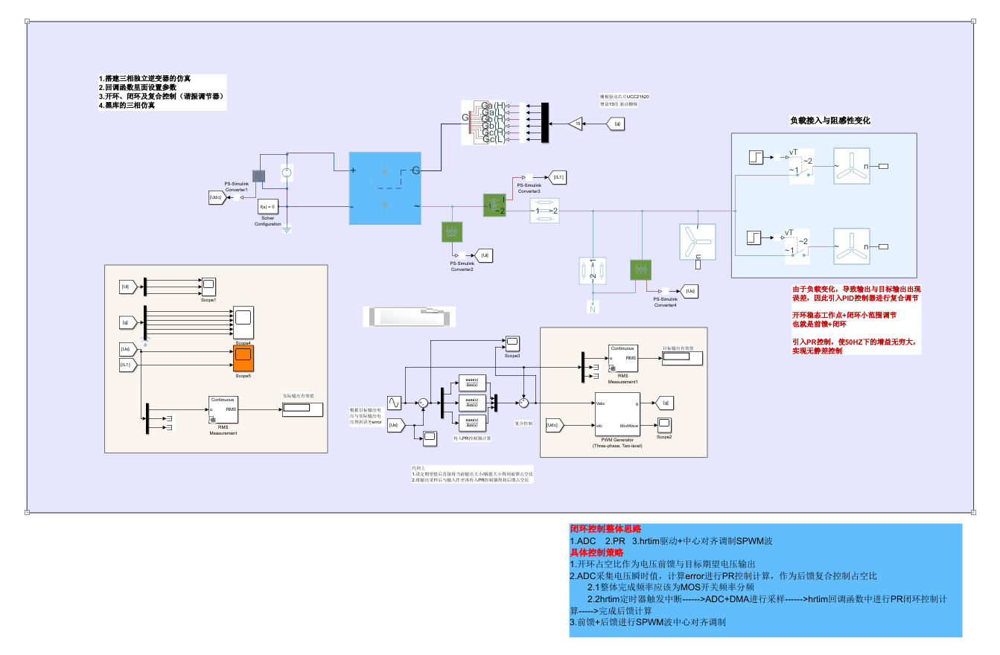
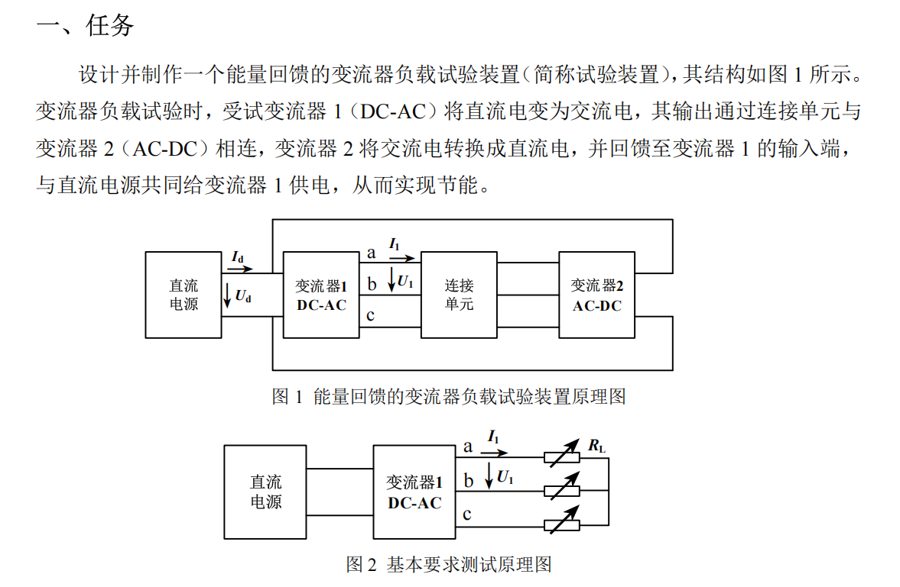
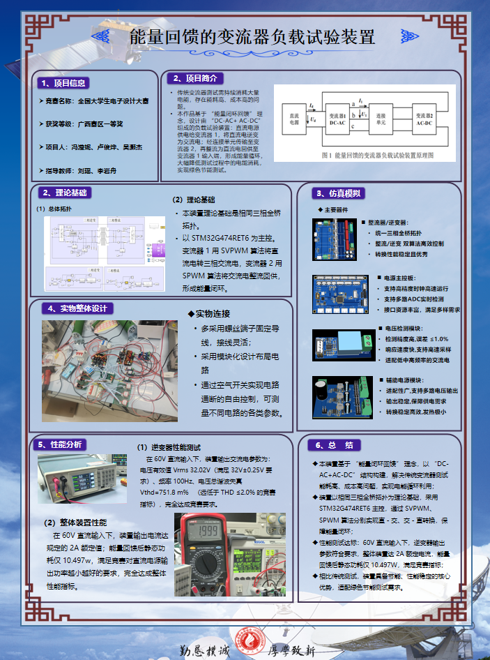

# 🏆 2025年全国大学生设计大赛：能量回馈的变流器负载实验装置（A题）

> **摘要**：本项目基于 STM32G474 主控实现，沿用 RoboMaster 电控分层框架开发。针对赛题要求，设计了基于 **QPR（电压环）+ P（电流环）** 的双环控制策略实现单相/三相逆变，并采用 **开环比例缩放** 策略快速实现能量回馈整流功能。

---

## 📝 写在前面

笔者并未系统学习过开关电源的控制原理，仅依靠先前对机器人电控工作的经验进行本次项目的开发。

好在赛前与团队成员形成良好的分工合作，并利用 Bilibili、知乎、CSDN 等网站补齐了一些环路控制原理与 **QPR 控制器**的知识，最后成功完成赛题所有指标。

虽然在综测环节因一些问题执戟沉沙仅获得**省一**，但对于笔者仍然是一次宝贵的竞赛体验。同时也让我建立起了对硬件开发与电源技术的兴趣，这是过往 RoboMaster 电控经历不曾带给我的。

同时感谢我的两位队友冯滢妮和吴灏杰，没有你们的坚持和努力以及对我的信任，我想这次电赛又会像24年一样含泪省四。

---

## 📂 文件目录结构

* `..\code`
    * **项目作品完整代码**：包含完整的工程文件及源代码。
* `..\simulink`
    * **仿真模型**：备赛期间参考 B 站 UP 主“西瓜粥”搭建的仿真模型。
    * **包含**：单相逆变、离网三相逆变、并网三相逆变。
    * 
* `..\A题_能量回馈的变流器负载试验装置`
    * 
* `..\作品海报`
    * 
* `..\picture`
    * **图片**
---

## 🛠️ 开发平台

### 💻 软件环境
1.  **MCU 开发/调试平台**：
    * `CLion` + `STM32CubeMX` + `Ozone 3.24` + `DAPLink`
2.  **仿真搭建平台**：
    * `MATLAB R2023a`

### ⚙️ 硬件环境
1.  **主控芯片**：`STM32G474RET6`
2.  **电路选型**：(具体电路原件选型略)

---

## 🧠 软件实现思路

### 1. 代码架构
代码框架沿用了我之前搭建的 RoboMaster 电控框架，采用分层设计模式：

* **Application Layer (APL)**：应用层，负责顶层逻辑与任务调度。
* **Middleware Layer (MWL)**：中间件层，处理算法与通用逻辑。
* **Hardware Driver Layer (HDL)**：硬件驱动层（如 `HDL_AC_Measure.cpp`），负责传感器数据读取与底层驱动。
* **Hardware Abstract Layer (HAL)**：硬件抽象层，封装芯片外设接口。

> **核心控制环路位置**：
> `code/Users/0-APL/APL_CallBack/CallBack_ADC/CallBack_HRTIM.cpp`

### 2. 闭环控制整体思路

* 逆变控制思路：
`ADC 采样` $\rightarrow$ `QPR 控制器计算电压环输出` $\rightarrow$ `P 控制器计算电流环输出` $\rightarrow$ `中心对齐 SPWM 调制`  $\rightarrow$ `HRTIM 调整占空比`
* 整流控制思路：
`逆变 SPWM 调制缩放*0.904（测量值）`  $\rightarrow$ `HRTIM 调整占空比` 
<u>之所以采取这种控制方式单纯是因为整流的PR调不出来了，这种方法可以极快速地实现能量的正向流动。<u>

**广西大学** 
**卢俊烨** 
**2025.12.05** 

